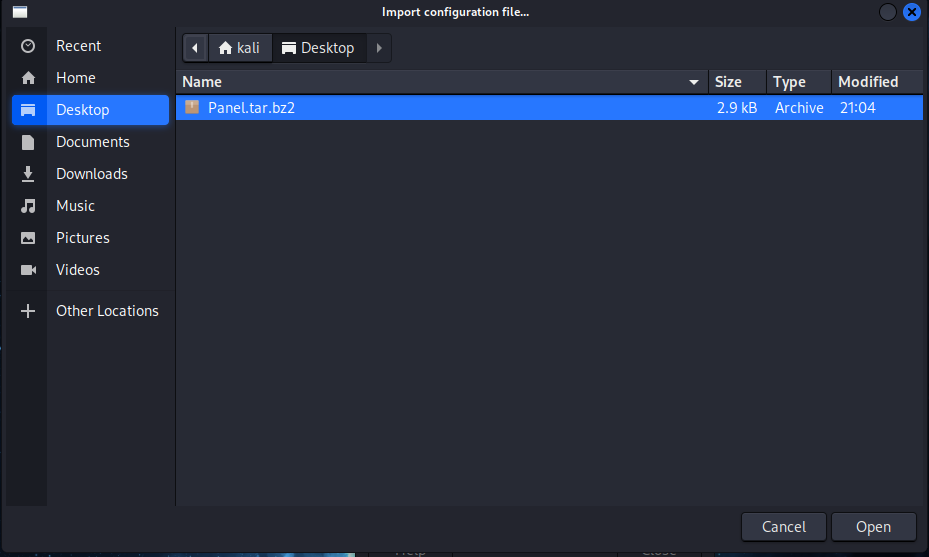

# KaliDesign

- Este script ha sido creado por investigación propia, con el fin de tener un entorno que permita optener elementos interestes de los proyectos bspwm pero sin complejidad que puede causar errores.
- Este script ha sido sido testeado en kali linux nativo y máquina virtual, se desconoce si puede acarrear problemas en otros sistemas operativos que no sean kali linux.
- Este entorno fue pensado para el entorno de escritorio XFCE (thunar)
- Si tienes alguna duda o deseas que implemente alguna nueva funcionalidad no dudes en consultarme
- No es una personalizacion profunda, inicialmente solo se busca satisfacer las primeras necesidades a la hora de realizar ejercicios "Capture The Flag".

## Vista general

## Componentes:

- Inicialmente solo se utilizaron las herramientas que se instala el Kali Linux

# Instalación

- apt update && apt upgrade -y

- git clone https://github.com/Archimarks/KaliDesign.git

- cd KaliDesign/

- chmod +x AutoInstall.sh

- ./AutoInstall.sh

# Importar de panel

- 1. Presionar el panel .... Panel preferences...

- 2. Presionar el Backup and restore.

- 3. Presionar el import.

- 4. Selecionamos donde esta ubicado nuestro Panel.tar.bz2

- 5. Guardamos la información.

- 6. Selecionamos la cinfiguracion y presionamos ApplyConfiguration.

- 7. Presionamos Apply Configuration.

## Créditos

Autor: Archimarks
